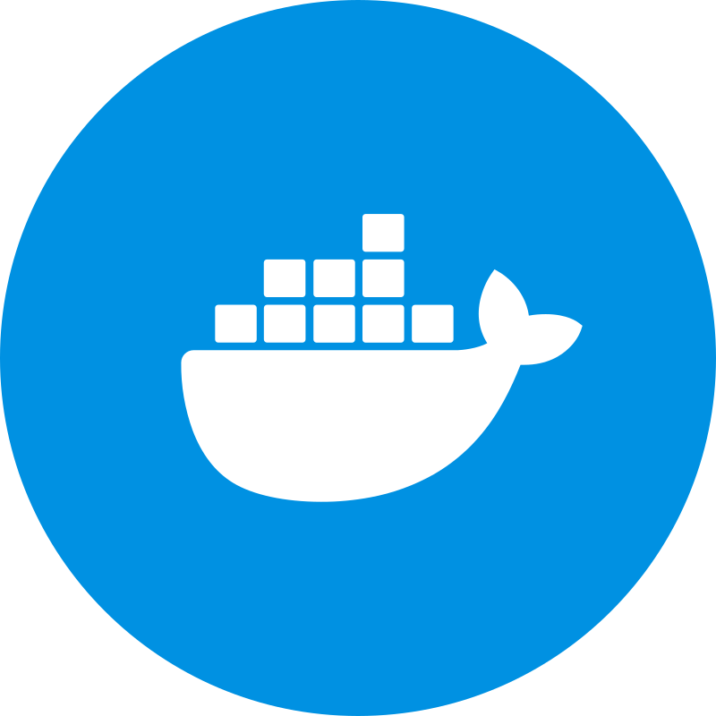
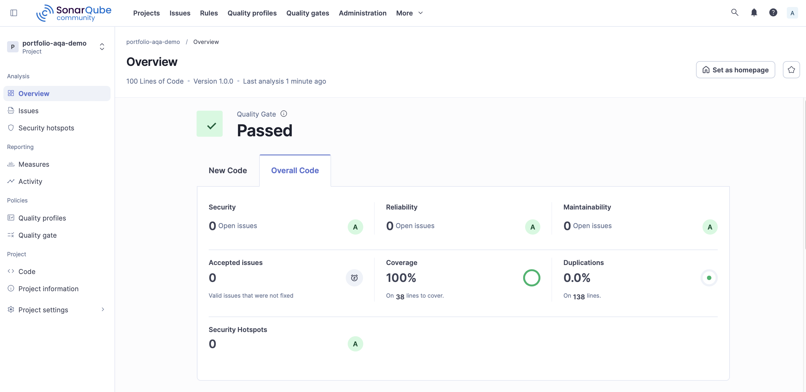
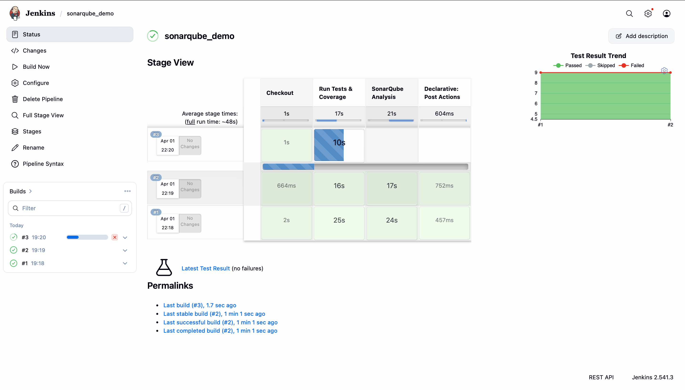
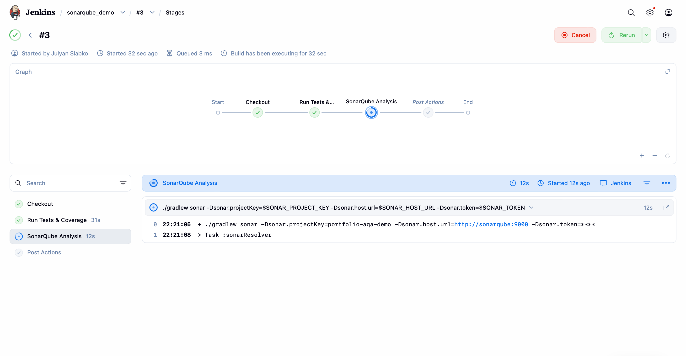

# SonarQube Demo — Unit Testing & CI Quality Gate
This project demonstrates a Java-based automation portfolio setup focused on **unit testing**, **code coverage**, **static code analysis**, and **CI quality control**.


<p align="center">
  
</p>

---

## Content

- [Tools](#tools)
- [What This Project Demonstrates](#what-this-project-demonstrates)
- [Running Tests Locally](#running-tests-locally)
- [Running with Docker](#running-with-docker)
- [SonarQube Analysis](#sonarqube-analysis)
- [Jenkins Pipeline](#jenkins-pipeline)
- [Example Screenshots](#example-screenshots)

---

## Tools

<p align="center">
  
  
  
  
  
  
</p>

---

## What This Project Demonstrates

- Writing unit tests with JUnit 5
- Running builds with Gradle Wrapper
- Measuring coverage with JaCoCo
- Running SonarQube analysis
- Using Docker Compose
- CI pipeline with Jenkins
- Quality Gate validation


---

## Running Tests Locally

Run tests:

```
./gradlew clean test
```

> If you get `Permission denied` on macOS/Linux: chmod +x gradlew

---

## Running with Docker

Start services:

```
docker compose up --build
```

or

```
docker-compose up --build
```

---

## SonarQube Analysis

```
./gradlew sonarqube \
  -Dsonar.projectKey=sonarqube-demo \
  -Dsonar.host.url=http://localhost:9000 \
  -Dsonar.login=<YOUR_TOKEN>
```
---

## Jenkins Pipeline

Pipeline flow:

1. Checkout
2. Build
3. Run tests
4. SonarQube scan
6. Quality Gate

Command example:
```
./gradlew clean test sonar
```
---

## Example Screenshots

### SonarQube
<p align="center">
  
</p>

### Jenkins Stages
<p align="center">
  
</p>

### Jenkins Pipeline Overview
<p align="center">
  
</p>
